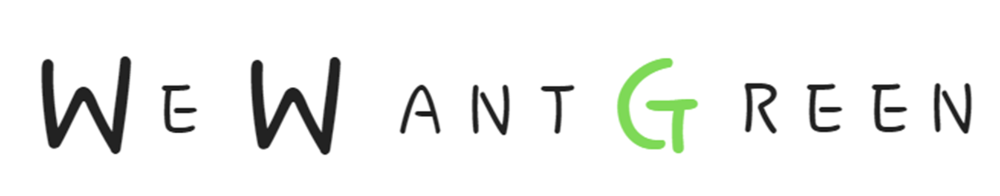
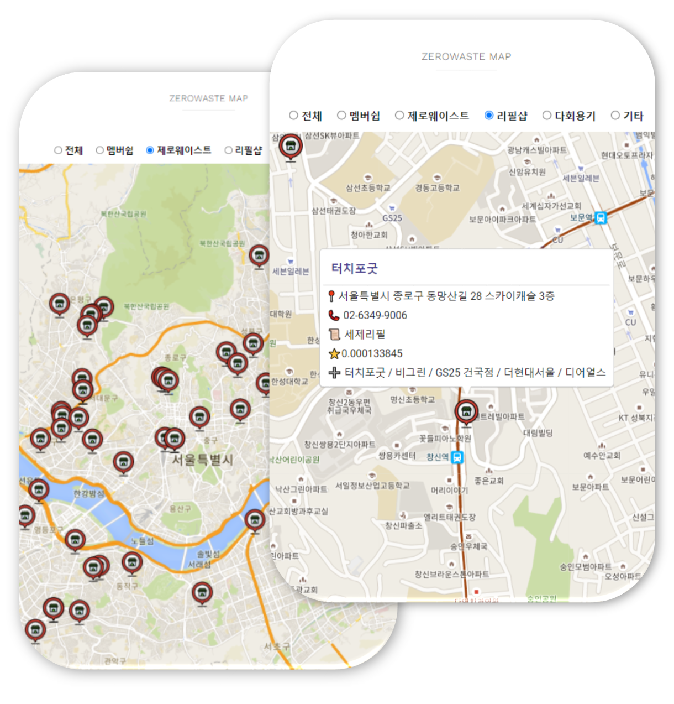
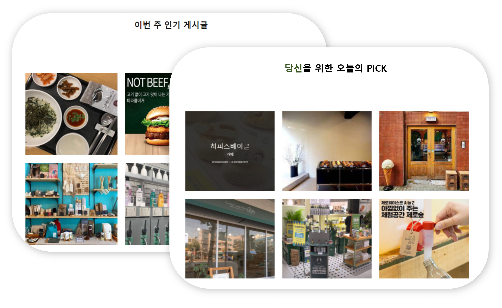
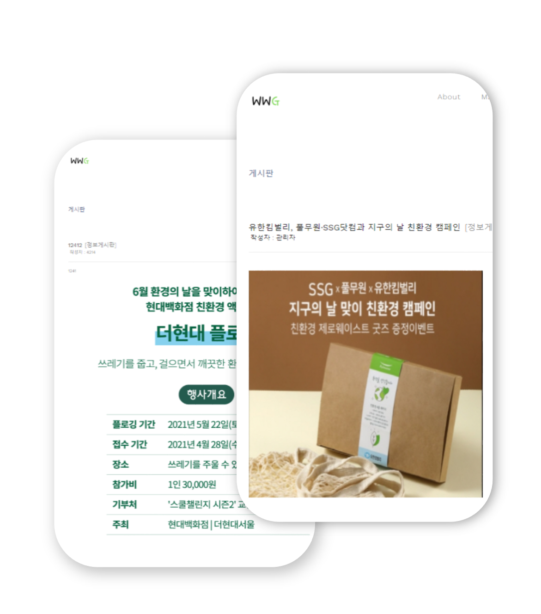

# [WWG] 그린슈머를 위한 추천서비스 

  

*edit by ominiv*

> ## 기획 배경
> 지속가능한 발전이 사회적으로 떠오르면서  
> 그 중 사람들이 가장 관심을 가지는 환경분야를 타겟으로 서비스를 기획함  
> 그린슈머를 대상으로  **비건식당,마켓의 위치 서비스** 제공과 **유저별 장소 추천서비스** 제공
> 
> ## 기획 목적
> 친환경소비에 대한 인식 제고
> 
> ## 기획 요약
> 친환경 음식점과 마켓에 대한 정보를 안내  
> 개인의 취향에 맞는 장소 추천 서비스 
> 유저간 함께 소통할 수 있는 커뮤니케이션 공간생성
> 

---

## 주요업무

1. 데이터수집
    
    *비건식당&제로웨이스트샵&리필샵 데이터수집*
    
    *공공데이터포털과 카카오맵 데이터 이용*
    
2. 데이터전처리
    
    *주소가 없는 상호 제거 & 상호별 위도, 경도 추출*
    
3. 모델선택 및 학습/예측
    
    *로그인을 할 경우, SGD Matrix Factorization기반 Collaborative Filtering 진행함 유저의 상호 클릭 수를 RMSE가 최소가 되도록 행렬분해를 진행한 후 유저벡터와 장소벡터를 내적하여 유저의 상호 클릭수에 대한 기대값 추출.*
    
    *로그인 하지 않을 경우, Contents based Filtering 진행 ([소재지], [업종] 이용)*
    
4. 웹 구현
    *Django 프레임워크를 이용*
    
5. 수행결과
    
    a. 주변의 식당 정보제공

    

    b. 개인의 취향에 따른 추천서비스

    

    c. 친환경과 관련된 정보제공

    

---

### 결과

- 그린슈머를 위한 주변의 음식과 제품을 파는 마켓의 정보를 제공
- 개인이 선호할 만한 장소 추천 서비스 제공
- 유저 간의 정보를 공유, 소통이 가능한 공간 제공