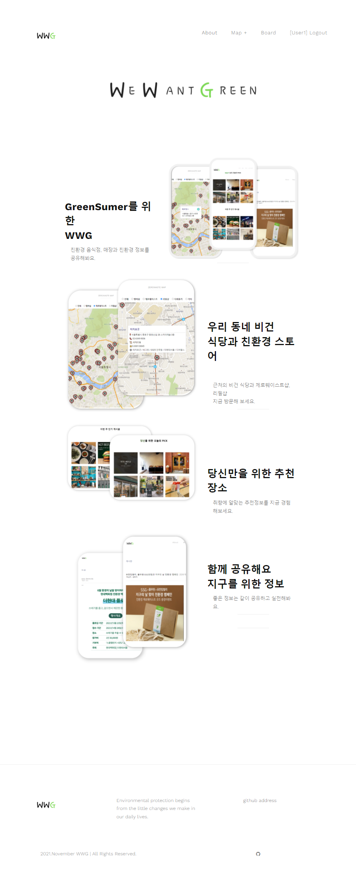

# [WWG] 그린슈머를 위한 추천서비스 

   

*edit by ominiv*

본 프로젝트는 친환경 소비 인식제고를 위해 진행되었습니다. 오로지 비영리 목적인 학습용도로 진행된 점 참고 부탁 드립니다 :)

---

## 기획 배경
지속가능한 발전이 사회적으로 떠오르면서  
그 중 사람들이 가장 관심을 가지는 환경분야를 타겟으로 서비스를 기획함  
그린슈머를 대상으로  **비건식당,마켓의 위치 서비스** 제공과 **유저별 장소 추천서비스** 제공

## 기획 목적
친환경소비에 대한 인식 제고

## 기획 요약
친환경 음식점과 마켓에 대한 정보를 안내  
개인의 취향에 맞는 장소 추천 서비스 
유저간 함께 소통할 수 있는 커뮤니케이션 공간생성

---

## 주요업무

1. 데이터수집 비건식당&제로웨이스트샵&리필샵 데이터수집 공공데이터포털과 카카오맵 데이터 이용
    
2. 데이터전처리 Outlier, Null 제거 & MinMaxScaling
    
3. 모델선택 및 학습/예측 로그인을 할 경우, SGD Matrix Factorization기반 Collaborative Filtering 진행함 유저의 상호 클릭 수를 RMSE가 최소가 되도록 행렬분해를 진행한 후 유저벡터와 장소벡터를 내적하여 유저의 상호 클릭수에 대한 기대값 추출. 로그인 하지 않을 경우, Contents based Filtering 진행 ([소재지], [업종] 이용)
    
4. 웹 구현 Django 프레임워크를 이용
    
5. 수행결과 
    
---

### 결과

- 그린슈머를 위한 주변의 음식과 제품을 파는 마켓의 정보를 제공
- 개인이 선호할 만한 장소 추천 서비스 제공
- 유저 간의 정보를 공유, 소통이 가능한 공간 제공
